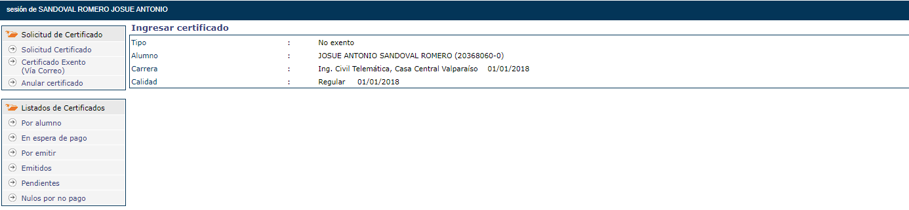

## **Tarea 1**
### **Problema 1**

Lo primero que se muestra al ingresar a la pestaña de "Certificados" de Siga es la siguiente pagina, donde hay 2 carpetas que contienen distintos tipos de acciones para realizar/ver estos certificados. Sin embargo hay 2 opciones las cuales no se saben diferenciar bien una de la otra, "Solicitud de certificado" y "Certificado Exento", a simple vista pareciera que para pedir un certificado gratuito hay que entrar a la sección de "Solicitud de certificado" sin embargo,los certificados gratuitos se piden en la sección de "Certificados Exentos".

El gran error de esta sección esta dado por el orden y los nombres de las subsecciones, los cuales en vez de guiar al usuario dentro de su camino, terminan confudiendolo con su terminologia. 

Si en vez de separar los certificados gratuitos y de pago en "Certificado exento (Vía Correo)" , "Solicitud Certificado" y "Anular certificado" se separaran de la siguiente manera.

**"Solicitud de certificados"**

    --->"Certificados Gratuitos"

    --->"Certificados de Pago"

**"Anular solicitud"**

Se evitarian este tipo de problemas.

### **Problema 2** 

Una vez dentro de la sección de "Certificado extento" se muestra la siguiente interfaz, la cual nos permite elegir el tipo de certificado que queremos generar mediante los cuadros de texto, sin embargo hay un texto flotando que dice "Generar Certificado" y a la hora de interactuar con el, no hace absolutamente nada. 

Además si seleccionamos en las opciones cualquier tipo de certificado, en la pantalla aparece el siguiente icono sin ningún tipo de explicación dentro de la pagina

Si el usuario no se da cuenta de la aparición de este icono, puede pensar que la pagina esta en mal estado o que esa funcionalidad no esta implementa.

La pagina comete el error de la poca claridad de estos elementos. haciendo pensar que el texto "Generar certificado" sirve para realizar esta tarea en conjunto a la poca claridad del icono.

